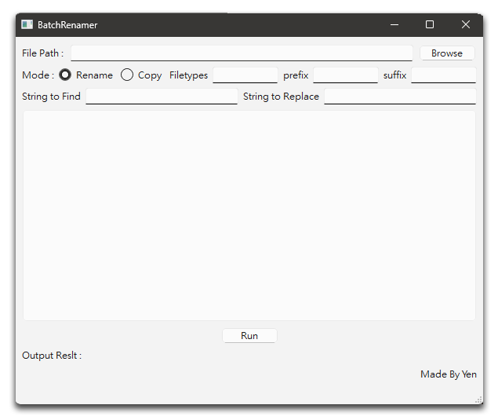

# Batch Renamer – PyQt5 GUI Tool

A lightweight, cross-platform GUI tool built with **Python + PyQt5** for batch renaming files. Designed for creatives, editors, and developers needing fast, customizable file renaming via a clean interface.


---

## 📦 Download

▶️ [Download Windows .exe (v1.0)](https://github.com/arklantis/batch_renamer/releases/latest)

> No installation required. Just download and run the executable.

---

## ✨ Features

- 🧩 Rename with custom prefix, suffix, numbering
- 🔍 Live filename preview before executing
- 📂 Load individual files or entire directories
- 💾 Fast, safe batch processing with error handling

---

## 🖼️ UI Preview

> Below is a screenshot of the application in use.  
> _(Image is located at `screenshots/ui_demo.png` in this repo)_



---

## 🚀 Run from Source

To run the application manually:

```bash
pip install -r requirements.txt
python batch_renamer_gui_starter.py
```
